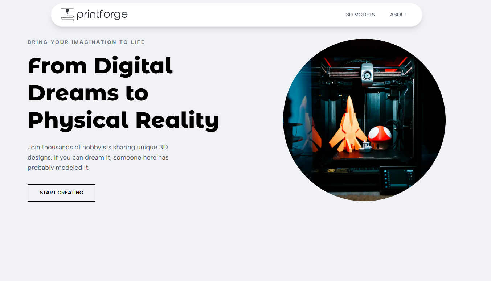
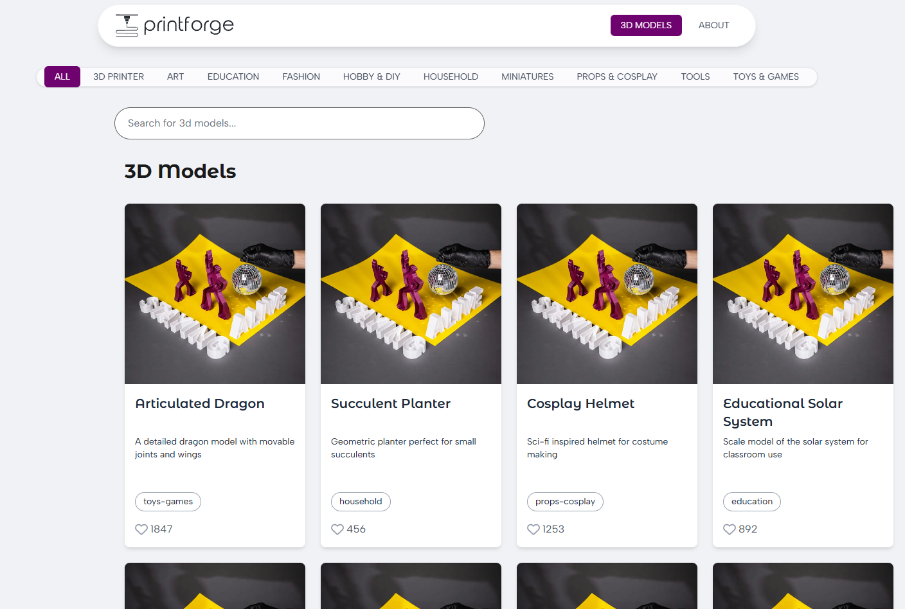
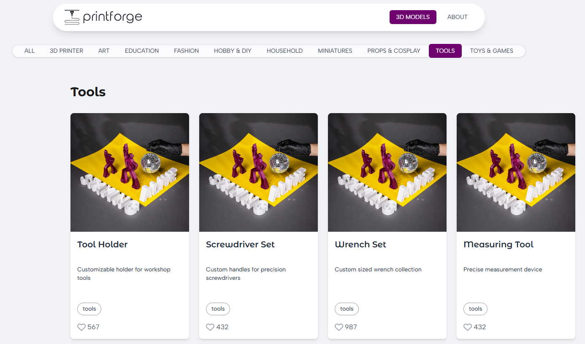
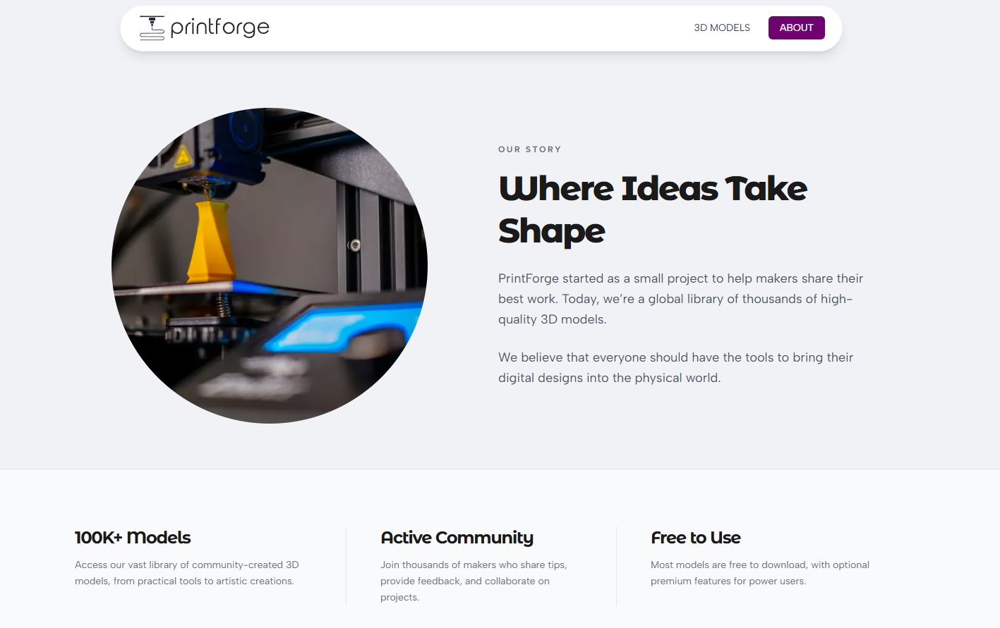

🛠️ PrintForge

PrintForge is a modern platform for 3D printing enthusiasts, makers, and professional designers to share and discover high-quality 3D models.

## 📸 Gallery

|              Main Landing Page              |                  Models Explorer                   |
| :-----------------------------------------: | :------------------------------------------------: |
|  |  |

|                 Category Filtering                 |             About PrintForge             |
| :------------------------------------------------: | :--------------------------------------: |
|  |  |

🚀 Features

- Curated 3D Models: Browse through a wide range of categories.

- Modern UI: Built with a sleek, floating navigation and glassmorphism effects.

- Performance First: Optimized using Next.js Image components for lightning-fast asset loading.

- Responsive Design: Fully functional on mobile and desktop.

🛠️ Tech Stack

- Framework: Next.js 15+ (App Router)

- Styling: Tailwind CSS v4

- Type Safety: TypeScript

- Deployment: Vercel

📂 Project Structure

This project uses Path Aliases (@/\*) for cleaner imports:

- @/components: UI components (Navbar, ModelGrid, etc.)

- @/utils: Utility functions and TypeScript types.

- @/public: Optimized SVG assets and logos.

🏁 Getting Started

1. Clone the repository:

git clone https://github.com/Anuska86/3d-printing

2. Install dependencies:

npm install

3. Run the development server:

npm run dev

4. Open the app: Navigate to http://localhost:3000 to see the result.

🎨 Design Tokens

The brand identity is centered around our custom "Brand Purple":

- Brand Color: #6e026f

- Font: Montserrat Alternates (via Next.js Google Fonts)

---

## 👤 Author

Ana Sappia Rey _Frontend Developer_

[]https://www.linkedin.com/in/ana-sappia-rey/
[]https://github.com/Anuska86

---
